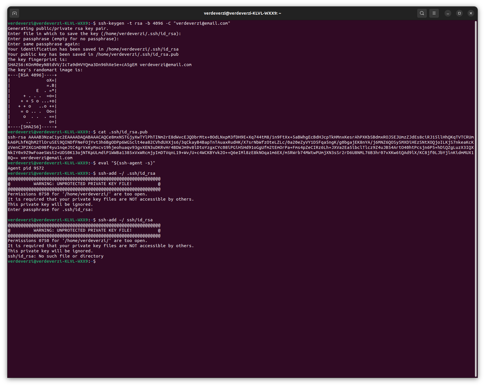

# Markdown (Repo title recommended)
## Headline 1
### Headline2

this is just **normal** text

use "** **" to make text bold
this is normal _text_
this is normal ~~text~~

~~this is normal text~~

> this is a quote Block

>> this is extra quote Block

To upgrade software in Linux, use the following commands

Normal code formatting :
```
sudo apt update
sudo apt upgrade /y
```

For terminal:
``` sudo apt update ```

For java script:
```javascript
console.log("hello")
```

For python
```python
print("hello")
```




for more info, visit [Github Docs](https://github.com/FbW-WD-22-E05-A/Lessons/tree/master/1_Basic-Digital-Literacy/1.2_Basic-shell-commands#01.-man-&---help) websi


| First Column | Second Column | Third Column|
|:---          | :---        |        ---: |
|Sudo          | Linux        | Windows     |
|NPM           |Nodejs        | Code        |

This project supports :
- [x] Windows
- [x] Linux
- [ ] IOS 


## Project Content
- [SupportedOS](#Supported-System)
- [Useful Resources ]


## Resources
1. Link for Github
2. Link for Google
   
